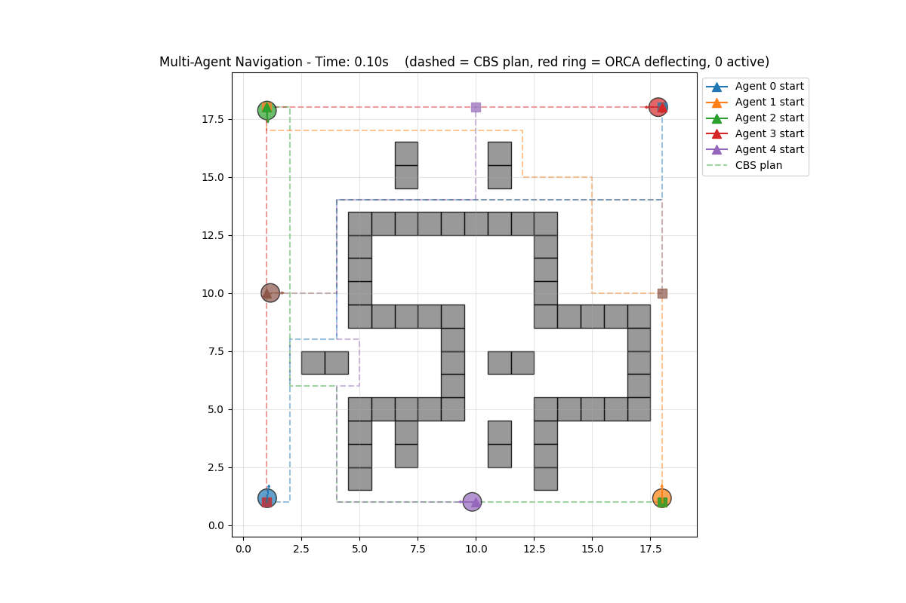
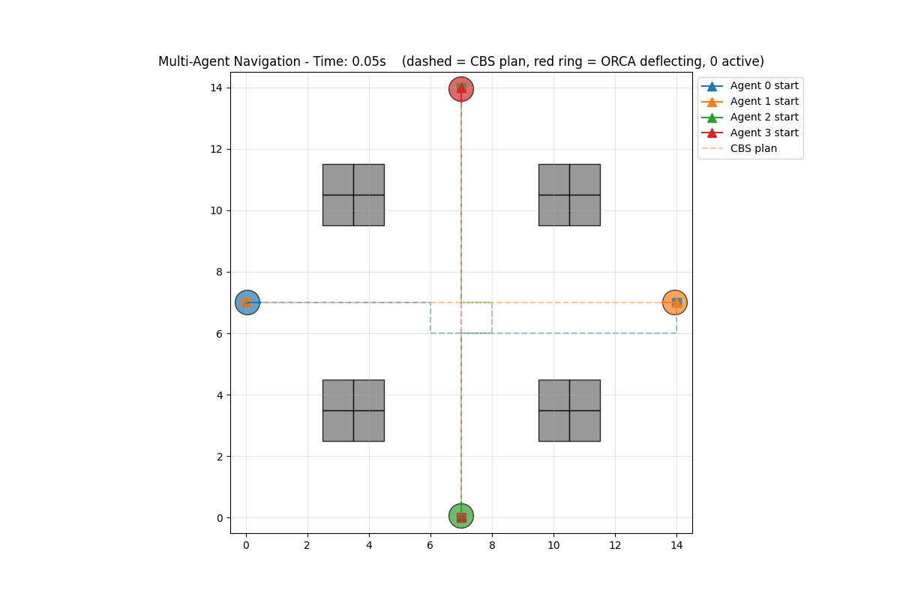
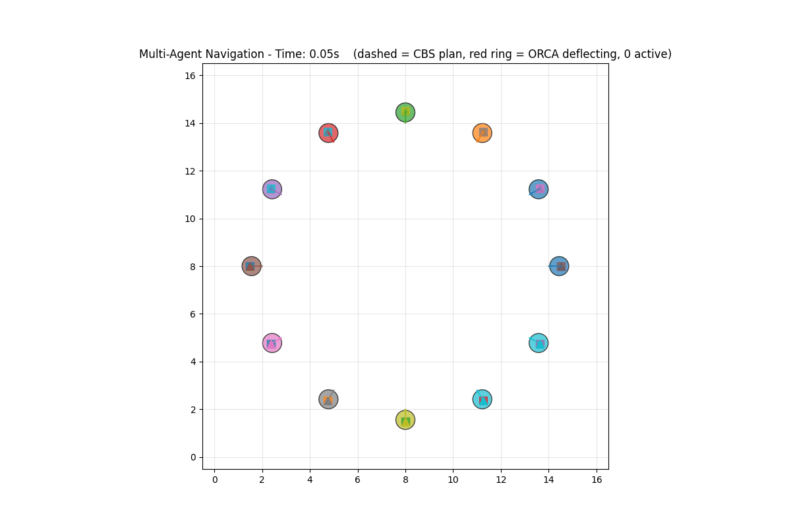

# High-Performance Multi-Robot Navigation Stack

[](https://github.com/aaholmes/multiagent-pathplanning/actions/workflows/ci.yml)

A two-layer navigation stack for multi-agent systems, combining optimal global
path planning with real-time, reactive collision avoidance.

The solver is written in Rust for performance and is wrapped in a Python API
for easy use in simulations and other applications.

## Demo

Six agents navigating a maze, and four agents crossing paths. The **dashed
lines** are the CBS global plans; solid trails are the executed trajectories.
When an agent's velocity is being actively deflected away from its preferred
path-following velocity, a **red ring** appears around it and a gray arrow
shows the velocity it *wanted* — that's ORCA at work:





And the signature experiment from the ORCA paper (van den Berg et al. 2011):
twelve agents on a circle, each heading to the antipodal point, with **no
global planner at all** — pure ORCA resolves the 12-way encounter into the
characteristic rotating vortex:



## Core Concepts: A Two-Layer Architecture

A robust navigation system needs to operate on two levels: long-term strategy
and short-term reflexes. This project implements both.

### Global Planner: Conflict-Based Search (CBS)

At the global level, this project uses Conflict-Based Search (CBS), which
finds a minimum-total-cost set of conflict-free grid paths for all agents. It
acts as the "strategist," providing each agent with a complete plan assuming
a perfect world. The implementation follows Sharon et al. (2015): a low-level
time-expanded A* plans each agent under vertex and edge constraints, and a
high-level best-first search over a constraint tree branches on conflicts
until the cheapest conflict-free solution is popped.

### Local Planner: Optimal Reciprocal Collision Avoidance (ORCA)

At the local level, this project uses Optimal Reciprocal Collision Avoidance
(ORCA, van den Berg et al. 2011). ORCA acts as the "reflexes": at every
moment, each agent computes a half-plane constraint in velocity space per
neighbor and selects the safe velocity closest to its preferred velocity.
This lets agents gracefully handle dynamic situations and minor deviations
from their paths.

Velocity selection uses the paper's exact incremental geometric linear
program (~1 microsecond per agent, no external solver), with the
max-violation relaxation pass for infeasible dense crowds and deterministic
bilateral symmetry breaking to resolve head-on deadlocks without randomness.

The local layer is obstacle-aware: grid obstacle cells become hard ORCA
half-plane constraints (with the agent taking full responsibility, since
walls don't reciprocate), so local avoidance maneuvers cannot push an agent
through a wall.

## Features

- **Rust core**: CBS, time-space A*, and ORCA implemented in Rust
- **Python integration**: PyO3 bindings plus a simulation/visualization layer
- **Simulation suite**: scenario loading/generation, statistics, matplotlib
  visualization and animation export
- **Tested**: 170+ Rust tests plus a Python pytest suite, including
  optimality and collision-avoidance regression tests; CI runs build, tests,
  and lints

## Quick Start

### Prerequisites

- Python 3.8+
- Rust 1.82+
- Git

### Installation

```bash
git clone https://github.com/aaholmes/multiagent-pathplanning.git
cd multiagent-pathplanning

python3 -m venv .venv
source .venv/bin/activate  # On Windows: .venv\Scripts\activate

pip install -r requirements.txt
maturin develop --release

# Verify
python test_basic_import.py
```

If you encounter any issues, see the [INSTALLATION.md](INSTALLATION.md) guide.

### Running Your First Simulation

```bash
# Run a simple 2-agent scenario
python simulation/run_simulation.py --scenario scenarios/simple_2_agents.json

# Create and run a custom scenario
python simulation/run_simulation.py --create simple --agents 6 --width 20 --height 20

# Run with real-time visualization
python simulation/run_simulation.py --scenario scenarios/4_agents_crossing.json --real-time

# Save animation and plots
python simulation/run_simulation.py --scenario scenarios/complex_maze.json --save-animation results.gif --save-plots results/analysis

# Headless run (no GUI required)
python run_headless.py --scenario scenarios/simple_2_agents.json
```

## Project Structure

```
multiagent-pathplanning/
├── src/                    # Rust source code
│   ├── lib.rs             # Python bindings
│   ├── structs.rs         # Core data structures
│   ├── astar.rs           # Time-space A* pathfinding
│   ├── cbs.rs             # Conflict-Based Search
│   └── orca.rs            # ORCA collision avoidance (geometric LP)
├── simulation/            # Python simulation layer
│   ├── simulator.py       # Core simulation engine
│   ├── visualizer.py      # Visualization system
│   ├── scenario_loader.py # Scenario management
│   └── run_simulation.py  # Main runner script
├── scenarios/             # Example scenarios
├── tests/                 # Python test scripts
└── docs/                  # Design notes
```

## Core Components

### 1. Rust Core Library (`navigation_core`)

**Data structures:** `Point`, `Vector2D`, `AgentState`, `Grid`, `Task`

**Algorithms:**
- **A\***: single-agent time-expanded pathfinding under vertex/edge constraints
- **CBS**: optimal multi-agent path planning
- **ORCA**: real-time collision avoidance

### 2. Python Simulation Layer

**Core classes:** `Simulator`, `Visualizer`, `ScenarioLoader`, `StatisticsVisualizer`

## Usage Examples

### Basic Simulation

```python
from simulation import Simulator, ScenarioLoader, Visualizer

# Load scenario
config = ScenarioLoader.load_from_file("scenarios/simple_2_agents.json")

# Create and run simulation
simulator = Simulator(config)
final_state = simulator.run()

# Visualize results
visualizer = Visualizer(config)
visualizer.show_static(final_state)

# Get statistics
stats = simulator.get_statistics(final_state)
print(f"Success rate: {stats['summary']['success_rate']:.1%}")
```

### Custom Scenario Generation

```python
from simulation import ScenarioLoader

# Generate random scenario
config = ScenarioLoader.generate_simple_scenario(
    grid_width=20,
    grid_height=20,
    num_agents=8,
    obstacle_density=0.15,
    seed=42
)

# Save for later use
ScenarioLoader.save_to_file(config, "my_scenario.json")
```

## Testing

```bash
# Rust unit and integration tests (no Python build required)
cargo test

# Python tests (require the built extension; see Installation)
pytest tests/test_python_layer.py
python tests/test_basic_functionality.py
```

## Benchmarking

Measure algorithm performance on your hardware:

```bash
python benchmark.py            # full suite
python benchmark.py --quick    # fewer iterations
python benchmark.py --orca-only
python benchmark.py --cbs-only
```

The ORCA benchmark feeds each agent its 10 nearest neighbors; the CBS
scenarios contain genuine crossing conflicts so the constraint-tree search is
actually exercised.

Several tests and scenarios reproduce examples from the source papers: the
bottleneck instance of Sharon et al. 2015 Fig. 1 (`test_cbs_paper_bottleneck_example`
asserts the optimal one-step-behind solution) and the ORCA circle-swap
experiment (`scenarios/circle_12_agents.json`, run ORCA-only via
`"use_global_planner": false`).

## License

This project is licensed under the MIT License - see the [LICENSE](LICENSE)
file for details.

## References

- **CBS**: Sharon, G., Stern, R., Felner, A., & Sturtevant, N. R. (2015).
  Conflict-based search for optimal multi-agent pathfinding. *Artificial
  Intelligence*, 219, 40-66.
- **ORCA**: van den Berg, J., Guy, S. J., Lin, M., & Manocha, D. (2011).
  Reciprocal n-body collision avoidance. *Robotics Research* (ISRR 2009),
  Springer Tracts in Advanced Robotics, vol 70.
